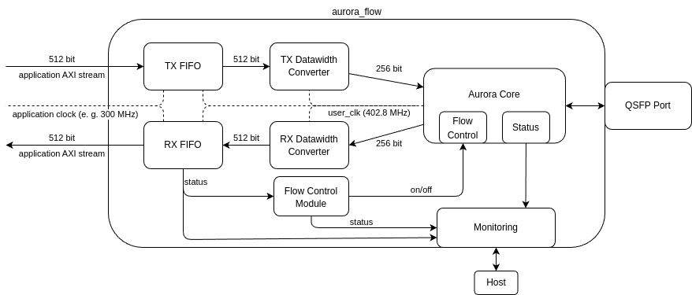

# AuroraFlow

Ready-to-link Aurora 64b66b IP for Xilinx Alveo cards, with flow control, monitoring, and full software/hardware emulation support.
Usable as a library in any Vitis project via Make or CMake.

A detailed analysis was published at HEART'25:

> Gerrit Pape, Bjarne Wintermann, Linus Jungemann, Michael Lass, Marius Meyer, Heinrich Riebler, and Christian Plessl. 2025. AuroraFlow, an Easy-to-Use, Low-Latency FPGA Communication Solution Demonstrated on Multi-FPGA Neural Network Inference. In *Proceedings of the 15th International Symposium on Highly Efficient Accelerators and Reconfigurable Technologies (HEART '25)*. https://doi.org/10.1145/3728179.3728190

## What you get

- A packaged RTL kernel (`aurora_flow_hw_0.xo`, `aurora_flow_hw_1.xo`) per QSFP port, based on the Xilinx Aurora 64b66b IP running on four lanes at 25.78 Gb/s each, totalling ~100 Gb/s per link
- Hardware flow control via the Aurora NFC interface, controlled by programmable RX FIFO thresholds
- A monitoring module that exposes status counters (GT lock, channel up, hard/soft errors, frame counters, FIFO overruns, NFC triggers)
- A header-only host-side API (`include/AuroraFlow.hpp`) that wraps the AXI-Lite control register interface
- Full emulation support through two replacement kernels:
  - `aurora_flow_sw_emu.xo`: HLS kernel that tunnels AXI-Stream through named pipes (fast, for HLS/host-code verification)
  - `aurora_flow_hw_emu_{0,1}.xo`: same RTL as hw, but the GT transceiver is replaced by a DPI-C pipe stub (cycle-accurate FIFO/NFC behavior, runs in xsim)
- Build integration fragments for both Make (`aurora_flow.mk`) and CMake (`cmake/FindAuroraFlow.cmake`)

Tested on the Alveo U280 with XRT 2.14, 2.15 and 2.16.



A working example application can be found in [`test/`](./test).
The rest of this README focuses on how to use the library in your own project.

## Repository layout

```
AuroraFlow/
├── rtl/                         RTL sources (Aurora wrapper, NFC, monitor, config,
│   │                            reset, and aurora_flow_gt_stub.sv + aurora_flow_dpi.c
│   │                            for hw_emu)
│   └── tb/                      Verilog unit testbenches (NFC, monitor, configuration)
├── tcl/                         IP creation and kernel packaging scripts
├── xdc/                         QSFP pinout constraints
├── hls/                         HLS kernel replacing the Aurora core in sw_emu
├── include/
│   └── AuroraFlow.hpp           header-only host API
├── cmake/
│   └── FindAuroraFlow.cmake     CMake integration (find_package)
├── Makefile                     library build, produces the .xo kernels
├── aurora_flow.mk               Make fragment to include from your Makefile
├── env.sh                       Noctua 2 software modules
└── test/                        example / benchmark application (see test/README.md)
```

## Building the library standalone

```bash
make aurora_hw      # builds build/aurora_flow_hw_0.xo, build/aurora_flow_hw_1.xo
make aurora_hw_emu  # builds build/aurora_flow_hw_emu_0.xo, build/aurora_flow_hw_emu_1.xo
make aurora_sw_emu  # builds build/aurora_flow_sw_emu.xo
make all            # all three
```

The RTL design has to create two instances, one for each port, with different module names.
Otherwise the clock constraints would shadow each other.
All artifacts are written under `$(BUILD_DIR)`, which defaults to `./build`.
You can override it with `make BUILD_DIR=/somewhere/else aurora_hw` to keep builds out of the source tree.

### Configuration parameters

```bash
make aurora_hw USE_FRAMING=1       # enable tlast/tkeep + Aurora CRC
make aurora_hw FIFO_WIDTH=32       # narrower input, saving the datawidth conversion 
```

All parameters are also forwarded automatically when the library is built through `aurora_flow.mk` or `FindAuroraFlow.cmake`.

| Variable              | Default | Meaning |
| --------------------- | ------- | ------- |
| `USE_FRAMING`         | `0`     | Use Aurora framing (adds `tlast`/`tkeep`, enables CRC per frame) |
| `FIFO_WIDTH`          | `64`    | AXI-Stream width in bytes (32 or 64) |
| `INS_LOSS_NYQ`        | `8`     | Channel insertion loss at Nyquist (dB, integer) |
| `RX_EQ_MODE`          | `LPM`   | RX equalization mode: `AUTO`, `LPM`, or `DFE` |
| `RX_FIFO_SIZE`        | `65536` | RX FIFO size in bytes (FIFO depth derived from this and `FIFO_WIDTH`) |
| `TX_FIFO_SIZE`        | `8192`  | TX FIFO size in bytes |
| `PART`                | `xcu280-fsvh2892-2L-e` | Target device part |
| `PLATFORM`            | `xilinx_u280_gen3x16_xdma_1_202211_1` | Target platform |

### FIFO configuration

The RX FIFO thresholds are used to control the Aurora NFC (Native Flow Control) interface.
The programmable full threshold triggers an XOFF, the programmable empty triggers XON. Defaults for the thresholds are `RX_FIFO_PROG_FULL = RX_FIFO_DEPTH / 2` and `RX_FIFO_PROG_EMPTY = RX_FIFO_DEPTH / 8`.
Experiments on our infrastructure have shown that around 250 transfers are in-flight after the XOFF.
With a FIFO size of 65536 bytes (1024 elements), this ensures enough space after the full threshold (512 elements).
The flow control module counts the number of in-flight transfers, so this can be used to resize the FIFO as needed.

On the TX side, the threshold signals serve no functional purpose except status reporting.
If you need a larger TX buffer, prefer sizing the AXI-Stream interconnect at the link level instead:

```
stream_connect=my_producer.data_output:aurora_flow_0.tx_axis:256
```

### Testbenches

```bash
make run_nfc_tb            # NFC (flow control) module
make run_monitor_tb        # Monitor/status counters
make run_configuration_tb  # Configuration register
```

Interactive variants with `_gui` suffix are also available.

## Using the library from a Make project

Add two lines to your Makefile:

```make
AURORA_FLOW_DIR := /path/to/AuroraFlow
include $(AURORA_FLOW_DIR)/aurora_flow.mk
```

You now have these variables available:

| Variable                  | Use |
| ------------------------- | --- |
| `AURORA_FLOW_XOS_HW`      | `.xo` paths for hw kernels (both instances). Pass to `v++ --link`. |
| `AURORA_FLOW_XOS_HW_EMU`  | `.xo` paths for hw_emu kernels |
| `AURORA_FLOW_XO_SW_EMU`   | `.xo` path for sw_emu kernel |
| `AURORA_FLOW_DPI_SRC`     | Path to `aurora_flow_dpi.c`. Required for hw_emu xclbin linking via `--vivado.prop`. |
| `AURORA_FLOW_INCLUDE`     | `-I` flag pointing at `AuroraFlow.hpp`. Add to your host `CXXFLAGS`. |
| `AURORA_FLOW_HEADER`      | Full path to `AuroraFlow.hpp`. List as a prerequisite of your host build rule. |

And these phony targets: `aurora_flow_hw`, `aurora_flow_hw_emu`, `aurora_flow_sw_emu`.
Each delegates to the library Makefile and forwards configuration overrides (`USE_FRAMING`, `FIFO_WIDTH`, `PLATFORM`, `PART`, ...) automatically.

Minimal application Makefile:

```make
AURORA_FLOW_DIR := /path/to/AuroraFlow
include $(AURORA_FLOW_DIR)/aurora_flow.mk

CXXFLAGS += -std=c++17 -I$(XILINX_XRT)/include $(AURORA_FLOW_INCLUDE)
LDFLAGS  += -L$(XILINX_XRT)/lib -lxrt_coreutil -luuid

my_host: my_host.cpp $(AURORA_FLOW_HEADER)
	$(CXX) -o $@ $< $(CXXFLAGS) $(LDFLAGS)

my_design.xclbin: $(AURORA_FLOW_XOS_HW) my_kernel.xo link.cfg
	v++ --link --target hw --platform $(PLATFORM) \
	    --config link.cfg --output $@ \
	    $(AURORA_FLOW_XOS_HW) my_kernel.xo

# hw_emu variant needs the DPI-C source for xsim
my_design_hw_emu.xclbin: $(AURORA_FLOW_XOS_HW_EMU) my_kernel_hw_emu.xo link.cfg
	v++ --link --target hw_emu --platform $(PLATFORM) \
	    --vivado.prop "fileset.sim_1.{xsim.compile.xsc.more_options}={$(AURORA_FLOW_DPI_SRC)}" \
	    --config link.cfg --output $@ \
	    $(AURORA_FLOW_XOS_HW_EMU) my_kernel_hw_emu.xo

# sw_emu variant uses the HLS file-link kernel as the Aurora replacement
my_design_sw_emu.xclbin: $(AURORA_FLOW_XO_SW_EMU) my_kernel_sw_emu.xo link.cfg
	v++ --link --target sw_emu --platform $(PLATFORM) \
	    --config link.cfg --output $@ \
	    $(AURORA_FLOW_XO_SW_EMU) my_kernel_sw_emu.xo
```

A full working example (including the v++ configuration files, HLS kernels, and run scripts) lives in [`test/Makefile`](./test/Makefile).

## Using the library from a CMake project

Point CMake at the library and call `find_package`:

```cmake
set(AURORA_FLOW_DIR "/path/to/AuroraFlow")
list(APPEND CMAKE_MODULE_PATH "${AURORA_FLOW_DIR}/cmake")
find_package(AuroraFlow REQUIRED)

target_link_libraries(my_host PRIVATE AuroraFlow::host)
```

`find_package(AuroraFlow)` defines:

- `AuroraFlow::host`: INTERFACE imported target, exposes the include path for `AuroraFlow.hpp`
- `AURORA_FLOW_XOS_HW` / `AURORA_FLOW_XOS_HW_EMU` / `AURORA_FLOW_XO_SW_EMU`: kernel artifact paths
- `AURORA_FLOW_DPI_SRC`: DPI-C source path (use with `--vivado.prop` for hw_emu)
- `aurora_flow_build_hw()` / `aurora_flow_build_hw_emu()` / `aurora_flow_build_sw_emu()`: functions that add custom targets which delegate kernel packaging to the library Makefile.

User-settable variables are namespaced to avoid collisions. Set any of `AURORA_FLOW_PLATFORM`, `AURORA_FLOW_PART`, `AURORA_FLOW_FIFO_WIDTH`, `AURORA_FLOW_USE_FRAMING`, before `find_package(AuroraFlow)`.

For a complete working example (host binary, HLS kernel compile, xclbin link for all three target modes), see [`test/CMakeLists.txt`](./test/CMakeLists.txt).

## The host API

`AuroraFlow.hpp` is a header-only wrapper around `xrt::ip` that exposes the Aurora core's AXI-Lite control registers as C++ methods. Construction:

```cpp
#include <AuroraFlow.hpp>

AuroraFlow aurora(0, device, xclbin_uuid);   // instance 0 or 1 (per QSFP port)
```

The same constructor works transparently in all three execution modes.
It detects `XCL_EMULATION_MODE` and in sw_emu manages the `aurora_flow_sw_emu` HLS kernel.
In hw_emu and hw it just binds to the `xrt::ip` object.

Common use:

```cpp
// Wait for link, then check configuration
if (!aurora.core_status_ok(3000)) {
    aurora.print_core_status();
    std::exit(1);
}
aurora.print_configuration();

if (aurora.has_framing()) {
    // Frame-level control is enabled, set tlast/tkeep in your producer kernel
}

// After a transfer
if (aurora.get_frames_with_errors() > 0) {
    // CRC mismatch, link integrity problem
}
if (aurora.get_fifo_rx_overflow_count() > 0) {
    // NFC was too slow, data loss happened
}
aurora.reset_counter();   // zero out for the next measurement window
```


Status signals surfaced by `core_status_ok()`:

| Name | Expected | Meaning |
| ---- | -------- | ------- |
| GT Powergood | `0b1111` | Transceiver powered up and ready, one bit per lane |
| Line Up | `0b1111` | Lanes initialized, one bit per lane |
| GT PLL Lock | `1` | Transceiver clock stable |
| MMCM not locked | `0` | MMCM generating a stable clock |
| Hard error | `0` | No buffer overflow / loss of lock (causes auto-reset) |
| Soft error | `0` | No protocol error (does not reset) |
| Channel Up | `1` | Full initialization complete |

For all available functions take a look at [`include/AuroraFlow.hpp`](./include/AuroraFlow.hpp).

## Emulation modes

Both emulation modes replace the QSFP physical link with Unix named pipes.
The AuroraFlow instance opens two pipes by **relative name in the process's cwd**:

```
./link_i{instance}_tx    (FIFO, the instance writes to it)
./link_i{instance}_rx    (FIFO, the instance reads from it)
```

- `instance`: local Aurora core (0 or 1)
- Each rank is expected to run in its own per-rank working directory that contains these FIFOs. See the rank-isolation note below.

Both `aurora_flow_sw_emu` (sw_emu, `hls/aurora_flow_sw_emu.cpp`) and `aurora_flow_gt_stub` (hw_emu, `rtl/aurora_flow_dpi.c`) open the same relative paths. The topology (which rank's `_tx` feeds which rank's `_rx`) is expressed by the symlink structure the caller creates before launch. Generating that layout is out of scope for AuroraFlow; the companion tool [topomux](https://github.com/papeg/topomux) can emit the right `rank{R}/link_i{I}_{tx,rx}` per-rank-dir layout for arbitrary topologies.

The emulation requires that the runtimes for each emulated FPGA are isolated, this is achieved with MPI in the examples.

### sw_emu

The Aurora kernel is replaced by an HLS kernel (`hls/aurora_flow_sw_emu.cpp`) that opens the pipes on startup and forwards AXI-Stream data through them.
This is useful for a first and quick test, but does not guarantee full semantics of the link behavior, especially becase AXI-Streams have infinited depth in software emulation.

### hw_emu

Same RTL as hw but with the GT transceiver replaced by `rtl/aurora_flow_gt_stub.sv`.
That module uses DPI-C functions (`rtl/aurora_flow_dpi.c`) to read/write the named pipes.
This gives you cycle-accurate FIFO, functional flow control (XOFF/XON triggering on programmable thresholds), and all available configuration/status registers are readable from the host.
The pipe-based link does not model the exact physical transceiver timing, but gets close.
The NFC inflight window is approximated with a fixed 256-cycle delay, and both clock domains run at the same frequency.

To link an `hw_emu` xclbin the DPI-C source must be compiled into xsim:

```
v++ --link --target hw_emu ... \
    --vivado.prop "fileset.sim_1.{xsim.compile.xsc.more_options}={$(AURORA_FLOW_DPI_SRC)}" \
    ...
```

`AURORA_FLOW_DPI_SRC` is provided by both `aurora_flow.mk` and `FindAuroraFlow.cmake`.

### xsim rank isolation

When running `hw_emu` under MPI, each rank needs its own working directory because xsim uses fixed socket and lock filenames that would collide between processes on the same host.
The typical pattern is a small wrapper script invoked by `mpirun` that creates `.hw_emu_rank_$RANK`, symlinks the xclbin + `emconfig.json` + host binary into it, and `exec`s the host binary from there.
See `test/scripts/hw_emu_rank_wrapper.sh` for a working example (15 lines).

## Noctua 2

Module loads for the Noctua 2 cluster are in [`env.sh`](./env.sh). There is also a [Quick Start Guide](https://upb-pc2.atlassian.net/wiki/spaces/PC2DOK/pages/356876352/AuroraFlow+Quick+Start+Guide) on the PC2 wiki.

<p align="center"><sup>Copyright&copy; 2023-2026 Gerrit Pape (gerrit.pape@uni-paderborn.de)</sup></p>
